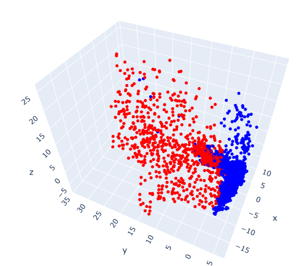

# Generative AI Autoencoder solution

This short notebook is a quick exploration of potential solution for the competition [Generative AI](https://bitgrit.net/competition/18).
The main idea is to explore dimensionality reduction techniques. The main results of this analysis is the derived latent space from a simple autoencoder. 

We see a clear distinction of the 2 labels. We can use this discovery of the latent space to do more advanced analysis. Some of the possible option to expand would be:

- Fine tune a AE or a VAE such that we get the best separation, then freeze the encoder and make prediction from there (using a NN or SVM).
- Create features from PCA and latent spaces to then apply classic ML algorithm like XGBoost, LGBM,.. to make prediction